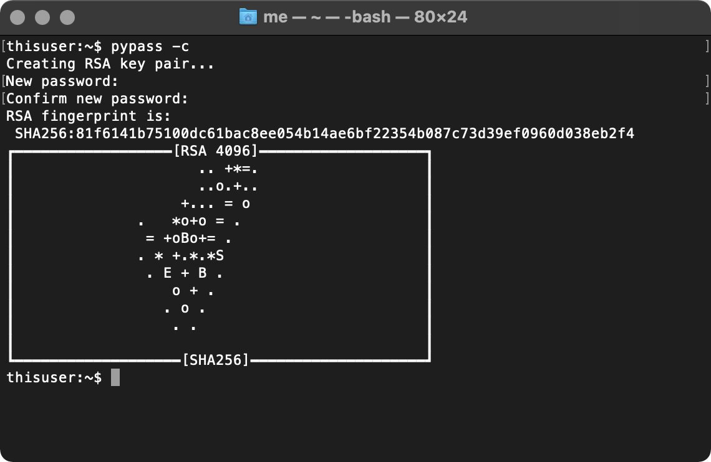
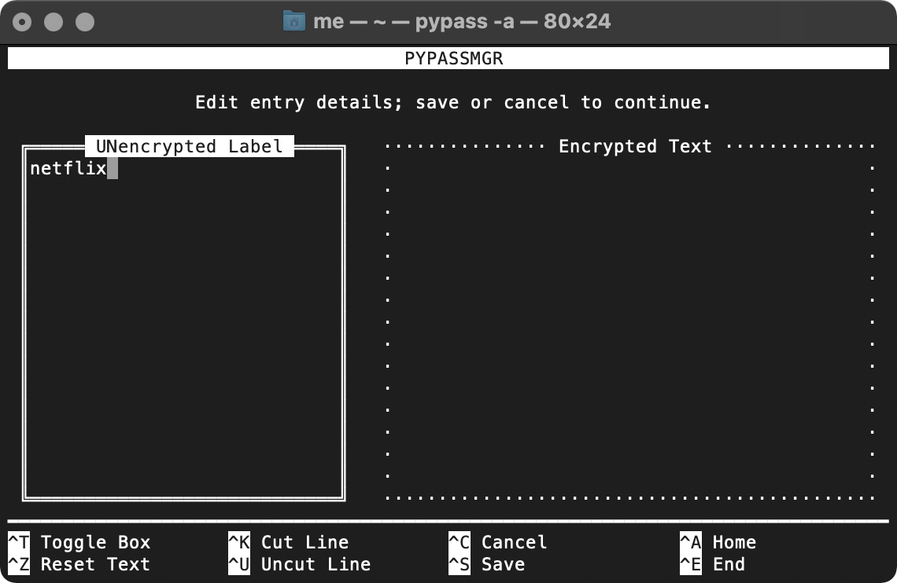
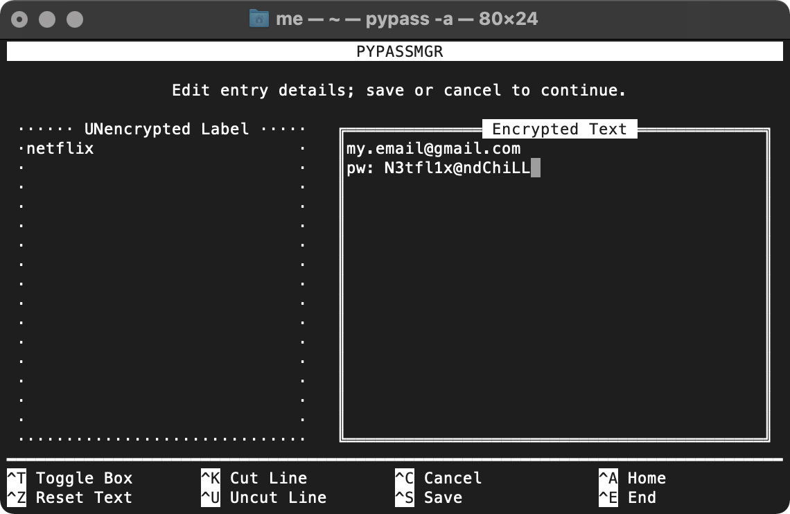
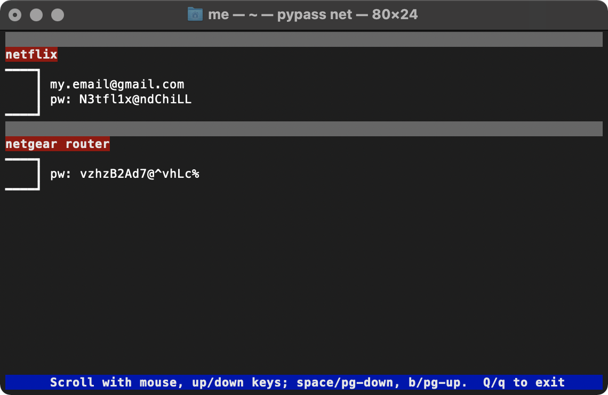
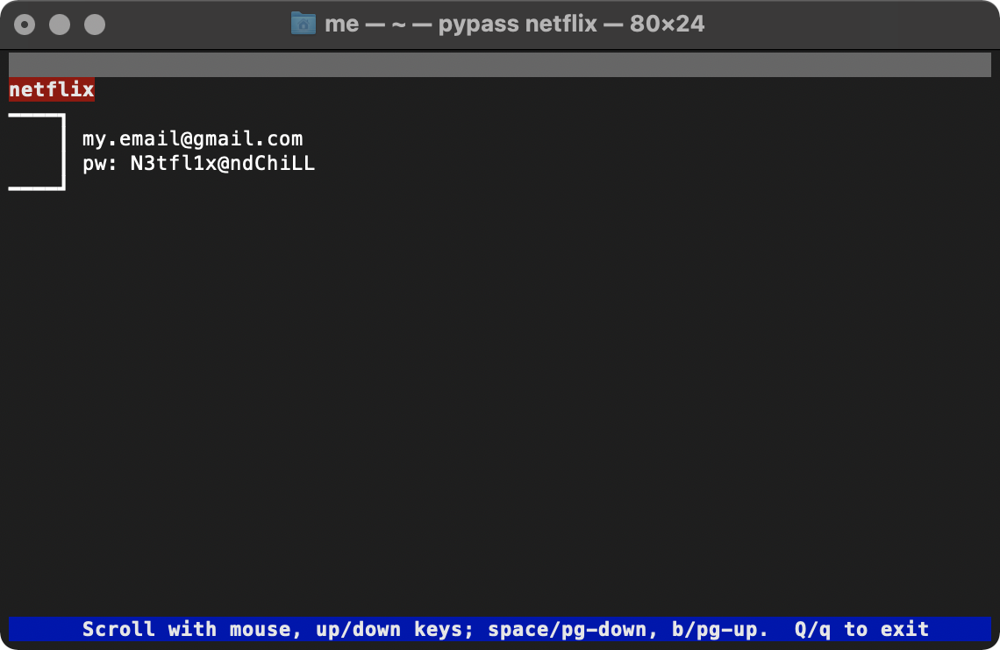
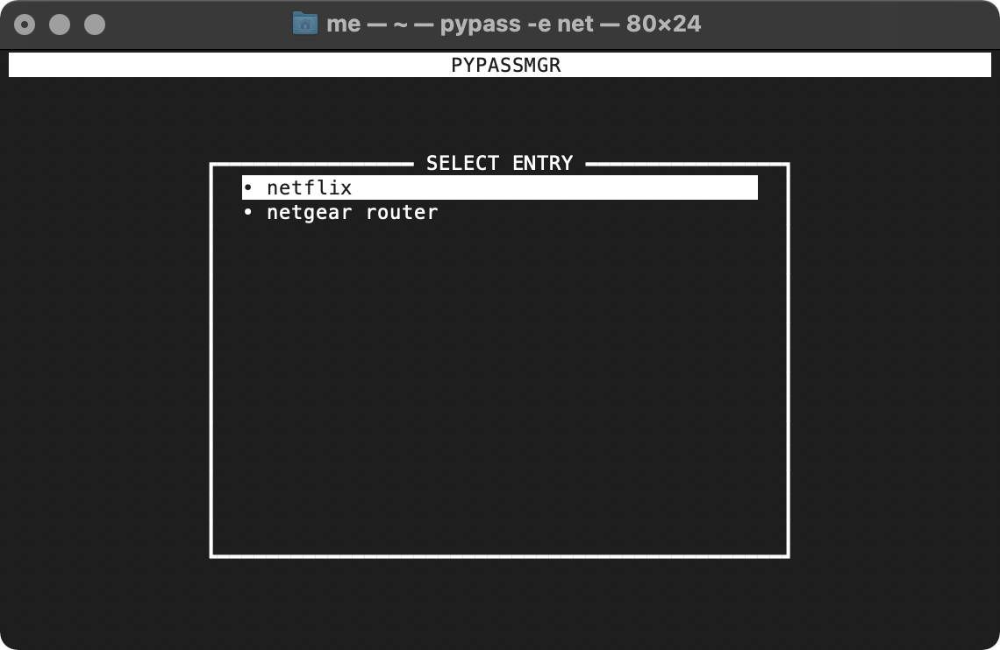
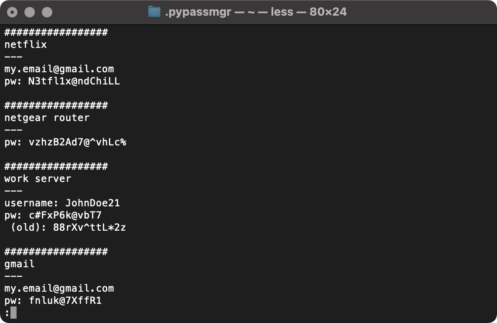
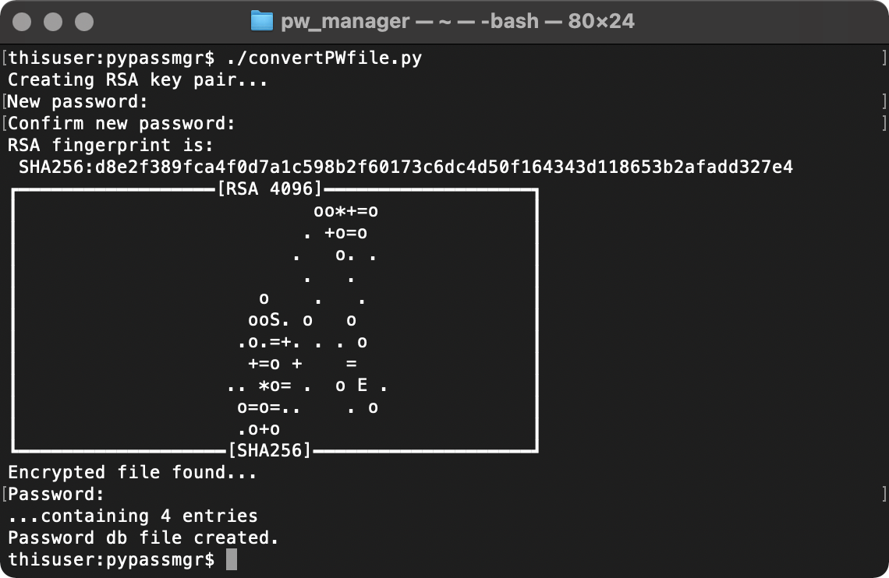
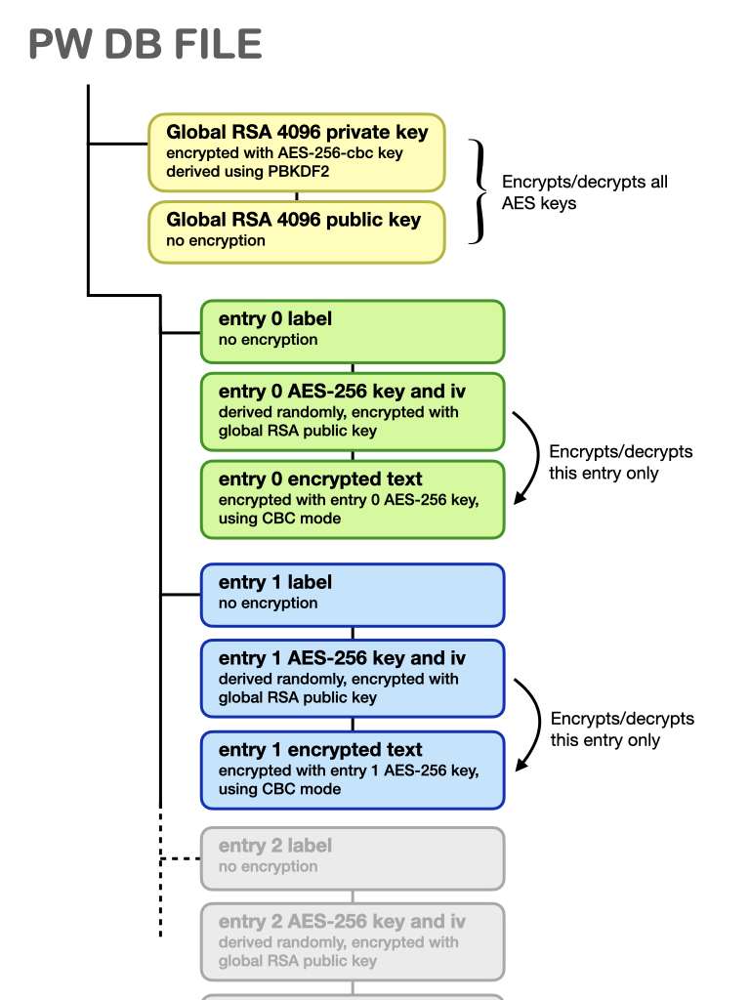

# pypassmgr

A text-based password manager, using pyca/cryptography's openssl python bindings.

Required modules, imported by pypassmgr:

- Built-in/standard modules (os, re, sys, base64, json, argparse, getpass, pydoc, subprocess)
- cryptography ([github](https://github.com/pyca/cryptography))
- urwid ([github](https://github.com/urwid/urwid))

I'm not a software developer and I built this tool for personal use.  To make this into a more professional tool, it will need to be installable (with proper dependency handling) using `distutils`.  I may do that in the future, but this has not been a priority because, again, this is mainly for my own use.  If it is of use to anyone else in its current form, the cryptography and interface (urwid) dependencies will have to be installed manually and made importable.

## Description and Usage

pypassmgr is a simple, command-line password manager.  At the heart of the password manager is a password database file; the security and encryption used are described in the next section.  The password database contains password entries; each entry consists of an unencrypted label, and an encrypted string that can contain passwords and any other information that the user wishes to encrypt (i.e. login usernames, old passwords, bank account numbers, etc.).  A suggested usage is to alias the `pypassmgr.py` executable as `pypass`:

```shell
thisuser:~$ alias pypass='pypassmgr/pypassmgr.py'
```

The first step in using this tool is to create the database with the `-c` flag, which involves creating the global RSA key pair:  



The RSA key hash and associated randomart are displayed (similar to generating ssh keys with `ssh-keygen`).  Now that the database and global cryptographic keys have been created, entries can be added to the database with the `-a` flag:

```shell
thisuser:~$ pypass -a
```

Note that one does not need to enter a password to add an entry, since the global cryptographic keys are asymmetric.  A dual text editor will be shown; both editors have a title that is self explanatory.  First, the user can type the text that will label this new entry; note that this label is later stored UNencrypted; this allows the database to be searched without having to decrypted all entries.  For example, here we may wish to store our login information for netflix



The controls for this dual editor are described in the footer.  The user can toggle to the right editor using `^T` or `tab` (or by clicking it with the mouse), and enter the encrypted text containing our login user/email and password:



The user can now save (`^S`) or cancel (`^C`), and is presented with a pop-up text box to confirm this selection.  Later, the user may wish to login to their netflix account and can search the password database (specifically, search the unencrypted entry labels) for a matching string, "`net`".  The search is case insensitive.  The search string is given as an argument (or arguments, if spaces are involved) to the command:

```shell
thisuser:~$ pypass net
```

The password manager then prompts the user for the global password if any entries are found which mach the given search string.  The matching entries are then decrypted and displayed:



Here we see that it found two entries that match the search string "`net`", displaying both of them.  As indicated by the blue footer, this screen will be displayed until the user presses `Q` or `q`.  Alternatively, the user may have refined their search using the full string "`netflix`":

```shell
thisuser:~$ pypass netflix
```

which in this case results in just a single entry being displayed:



The user can also edit an entry using the `-e` flag along with a search string (or no search string). A menu will the be displayed showing the entry labels which match the provided search string, and the user can make a selection.  For example, entering the search string "`net`":

```shell
thisuser:~$ pypass -e net
```

will produce this menu, which the user can use to select the entry they want to edit (pressing 'q' when this menu is displayed will cancel the operation):



When the selection is made, the user will then be prompted for their global password, and then provided with the dual editor that was used when creating the entry.  The two editor boxes will be pre-populated with the existing label and encrypted text.

A full list of command-line options is given here:

<table>
	<tr>
		<th>Command option</th><th>Description</th>
	</tr>
	<tr>
		<td><code>-h</code>, <code>--help</code></td><td>Show help message</td>
	</tr>
	<tr>
		<td><code>--file FILE</code></td><td>Specify the password-database file to use, if different from default.</td>
	</tr>
	<tr>
		<td><code>-t [N]</code>, <code>--top [N]</code></td><td>Display the first <code>N</code> entries (<code>N</code>=10 if no number is given)</td>
	</tr>
	<tr>
		<td><code>-b [N]</code>, <code>--bottom [N]</code></td><td>Display the last <code>N</code> entries (<code>N</code>=10 if no number is given)</td>
	</tr>
	<tr>
		<td><code>-c</code>, <code>--create</code></td><td>Create a new password file and RSA key pair.</td>
	</tr>
	<tr>
		<td><code>-a</code>, <code>--add</code></td><td>Add an entry</td>
	</tr>
	<tr>
		<td><code>-e</code>, <code>--edit</code></td><td>Edit entry</td>
	</tr>
	<tr>
		<td><code>-d</code>, <code>--delete</code></td><td>Delete entry</td>
	</tr>
	<tr>
		<td><code>--all</code></td><td>Display all entry labels in the password database</td>
	</tr>
	<tr>
		<td><code>--pwsearch</code></td><td>Search over the password strings rather than the label strings.</td>
	</tr>
	<tr>
		<td><code>--backup [BACKUP]</code></td><td>Backup all entries to a separate file that can be decrypted at the command line with an oppenssl command, shown below.</td>
	</tr>
	<tr>
		<td><code>--pw</code></td><td>Reset the global password (but keep the same RSA key pair)</td>
	</tr>
	<tr>
		<td><code>--rsa</code></td><td>Regenerate the RSA keypair, and re-encrypt all entries with the new key.</td>
	</tr>
	<tr>
		<td><code>--aes</code></td><td>Regenerate the AES key and iv for all entries</td>
	</tr>
	<tr>
		<td><code>--fingerprint</code></td><td>Print the RSA fingerprint and associated randomart</td>
	</tr>
</table>

BACKUP:
If the `--backup` option is invoked, all entries in the database will be written to an encrypted file that can be decrypted at the command line, without this tool.  One needs `openssl` to be installed. The default file name and location is `~/.pypassmgr/.backup`, though an alternate name and location can be provided.  To decrypt the backup file at the command line, the following command is entered:

```shell
openssl enc -aes-256-cbc -md sha512 -pbkdf2 -iter 100000 -salt -d -in ~/.pypassmgr/.backup -out <file>
```

where "`<file>`" is replaced with the desired unencrypted file.  Alternatively, the `-out` option can be left out, and the decrypted file will be written to stdout and can be piped to, e.g., `less` (so that there is no plain text stored on disk):

```shell
openssl enc -aes-256-cbc -md sha512 -pbkdf2 -iter 100000 -salt -d -in ~/.pypassmgr/.backup | less
```

In our example, that results in:



where we can see each entry is prefixed with a line of at least 17 hashes (`#`), and label and password texts are separated by a line of 3 dashes.

The backup file can also be used to rebuild a lost database file, using the included script "`convertPWfile.py`".  The user is prompted for a new password to encrypt the newly created RSA key pair, and also the password for the backup file.  `convertPWfile.py` can be run without arguments (if the backup file lives in `~/.pypassmgr/.backup`), or with an argument that tells the script where to find the backup file:



This script can alternatively be used to bulk populate a new database file with many entries at once, though this does involve storing the unencrypted password text on disk for a brief period.  The user creates a text file with the above syntax (called e.g. "`passwords.txt`"), then encrypt it with this command:

```shell
openssl enc -aes-256-cbc -md sha512 -pbkdf2 -iter 100000 -salt -in passwords.txt -out passwords.aes
```
The encrypted file `passwords.aes` can then be given as input to `convertPWfile.py`. If such an unencrypted file is created for this purpose, it is recommended that the unencrypted file then be safely deleted immediately using, for example:

```shell
rm -P passwords.txt
```

where the `-P` option overwrites the file three times with `0x00`, then `0xff`, and one more time of `0x00` before deletion.

## Password Security

All info, including encrypted passwords and cryptographic keys, are stored in a password database file.  The default location for this file is in

```bash
~/.pypassmgr/.passwords_db
```

Each entry in the DB contains its unencrypted label, its individual AES key, and encrypted text (i.e. passwords).  The DB file is a JSON structure, and is organized as described in this diagram:



Each entry gets its own individual AES-256 key and IV for CBC mode, which is used to encrypt the password text for that entry alone.  The individual AES keys are themselves encrypted/decrypted using the global RSA public/private key, utilizing OAEP padding.  This allows the user to add an entry without having to enter the password; it also means that only entries which match the search string are decrypted in memory. The global RSA key is length 4096; the public key is stored unencrypted, while the private key is encrypted with AES-256-CBC.  This AES key is derived from the global password using the PBKDF2 protocol, using the SHA 512 hash, salt, and 100000 iterations.